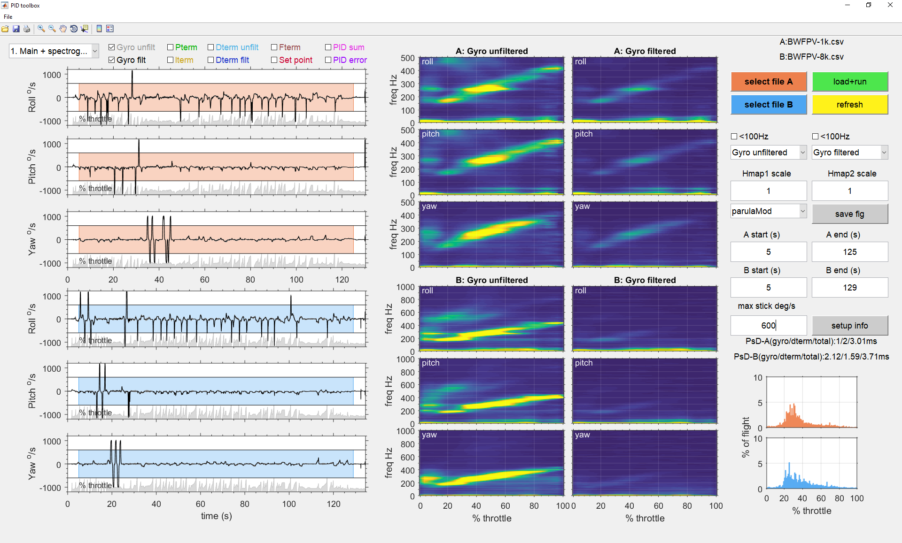
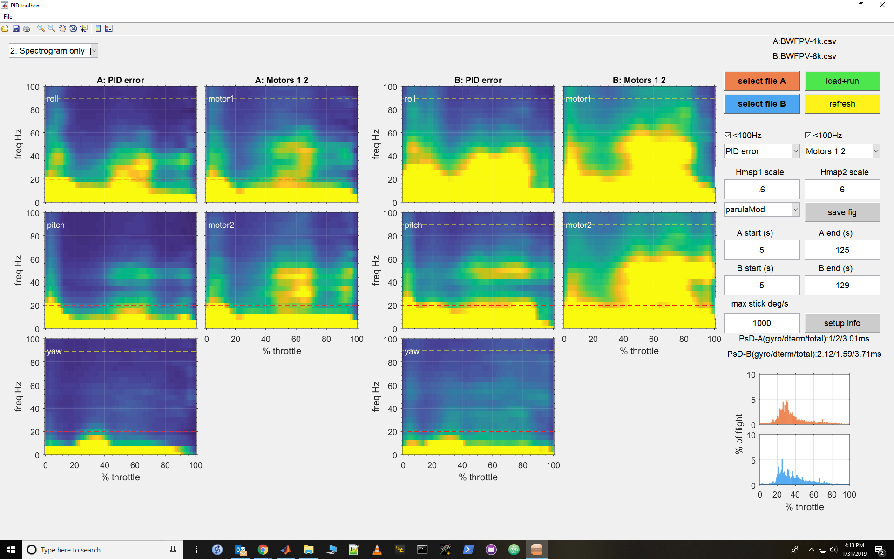

# PIDtoolbox

PIDtoolbox is a GUI-based Matlab tool for analyzing Betaflight blackbox log files for multirotors.

The motivation behind the development of this tool was to create a user-friendly, objective, method for comparing between flights. This was inspired by the way in which we often troubleshoot flight performance issues (e.g., vibrations, mid-throttle oscillation, propwash oscillation, etc). A typical scenario goes something like "run test flight 'A', make subjective assessment of performance, tweak parameters, run test flight 'B', make subjective comparison between A and B, re-tweak", and so on. The problem with this approach from a scientific standpoint is that it lacks objectivity and reliability. Subjective bias becomes particularly problematic when the differences between A and B are subtle. PIDtoolbox was designed with this in mind.

I am not an engineer, and what I know about control theory is limited to my 3-4 year experience with multirotors. So for engineer types out there, some aspects of PIDtoolbox might seem unconventional, and I welcome your feedback. That said, I'm a neuroscientist with about ~15ys publishing research on the <a href="https://sites.google.com/site/bjw112968/" target="blank">neural basis of oculomotor control</a>, which believe it or not has some similarities to the flight characteristics and data associated with multirotors. I also do research on neuronal oscillations, hence the emphasis on spectrograms in PIDtoolbox. PIDtoolbox was also inspired by Plasmatree PID-analyzer (https://github.com/Plasmatree/PID-Analyzer), and one of the goals was to extend some of that type of functionality here in a GUI-based program.

Over the past year or so, there has been increasing emphasis on advanced gyro and dterm filtering in flight controller software, particularly around the ~200-500Hz range associated with motor vibration, which has led to amazing improvments in flight characteristics. During that time I have analyzed a lot of Betaflight blackbox log data in Matlab and noticed a consistent pattern between copters that fly well and copters that do not, specifically in the 30-90Hz range. Most commanded copter motion is below ~20Hz (even if you're a Mr. Steele on the sticks, at best you might push this to 25-30Hz!), but from my analyses, elevated activity in the 30-90Hz range tends to correlate with the kind of vibrations we SEE during flight and in HD video (things like mid-throttle oscillation, propwash, jello, etc.). Although these frequencies cannot be filtered out, one of the goals of PIDtoolbox was to use this as an objective measure of flight performance, to help decide whether one's manipulation of software/hardware/mechanical/etc settings between A-B tests was effective. I'll show some examples that support this idea. I want to stress, however, that the goal of a well performing copter still involves reducing +100Hz noise (from motors etc.), and PIDtoolbox maintains the ability to plot the throttle x freq spectrograms that we have come to love about Plasmatree PID-analyzer. That said, I have a hunch that the way +100Hz noise is manifested in FPV and HD video feed (and let's be clear, this is the central way we experience flight performance) is in this ~30-90Hz band. In other words, while we may not see +100Hz vibration in the video feed directly, my hunch is that it's manifested in observable copter performance in this ~30-90Hz band, though as we will this is not exclusively the case.

Below is everything you need to begin using PIDtoolbox. I hope you find it useful, and I would really appreciate feedback from the FPV community.

Cheers! 
  -Brian White

# Download

There are a couple of ways you can download PIDtoolbox. 

**1)** If you have Matlab, you can simply download the repository of mfiles, place them in a folder, and run PIDtoolbox.m from the Matlab command prompt. You will need Signal Processing Toolbox installed for this to work.

**2)** If you do not have Matlab, you can download a standalone Windows version of PIDtoolbox. You must first install Matlab runtime (MATLAB® Compiler Runtime, MCR), which then allows you to run any standalone Matlab program.

**Steps:**

**(i)** Install Matlab runtime <a href="https://www.mathworks.com/products/compiler/matlab-runtime.html" target="blank">(Matlab-runtime)</a> for Windows (64bit only, version 9.3 R2017b). Unfortunately, it will likely not work for Windows 32bit users, so use at your own risk. I have not tested this extensively across multiple versions of Windows, so your feedback here will be very helpful. I will continue to provide updates in this regard so stay tuned. The good news is this is a one-time installation, after which you can run any Matlab standalone!

**(ii)** Download PIDtoolbox for Windows here:
<a href="https://github.com/bw1129/PIDtoolbox/releases" target="blank">(PIDtoolbox.zip)</a> Unzip and place entire folder in your preferred location on your computer. For Mac/Linux/others, if you have a bonafide copy of Matlab and can create your own standalone version of PIDtoolbox, it would be greatly appreciated if you could upload it here!

**(iii)** Run 'PIDtoolbox.exe', found in folder: 
'PIDtoolbox\for_redistribution_files_only\PIDtoolbox.exe'
NOTE: PIDtoolbox.exe and other files must remain in this folder.

If you have issues installing Matlab runtime, or running PIDtoolbox, please give feedback here:
<a href="https://github.com/bw1129/PIDtoolbox/issues" target="blank">(issues)</a>
or drop a post to the Betaflight BlackBox Log Review Facebook group: <a href="https://www.facebook.com/groups/291745494678694/?ref=bookmarks" target="blank">(Betaflight BlackBox Log Review Facebook group)</a>

# How to use

PIDtoolbox will support .bbl, .bfl, or .csv files, but there are a few things you need to know: 

**(i)** If you wish to use .bbl or .bfl files directly, you will need to have a copy of 'blackbox_decode.exe' in the same directory as your .bbl/.bfl files. 'blackbox_decode.exe' is part of Betaflight/cleanflight blackbox-tools, and can be downloaded here:
<a href="https://www.github.com/betaflight/blackbox-tools" target="blank">(Betaflight Blackbox-tools)</a>

**(ii)** My recommendation is use .csv files! BUT NOTE, you MUST convert your .bbl or .bfl file to a .csv file using Betaflight Blackbox-log-viewer. Save as .csv from there please! Betaflight Blackbox-log-viewer can be downloaded here: 
<a href="https://www.github.com/betaflight/blackbox-log-viewer/releases" target="blank">(Betaflight Blackbox-log-viewer)</a>

If you have issues installing Matlab runtime, or running PIDtoolbox, please give feedback here:
<a href="https://github.com/bw1129/PIDtoolbox/issues" target="blank">(issues)</a>
or drop a post to the Betaflight BlackBox Log Review Facebook group: <a href="https://www.facebook.com/groups/291745494678694/?ref=bookmarks" target="blank">(Betaflight BlackBox Log Review Facebook group)</a>

Now, let's get on with a few examples:

### E.G. (i) Mid-throttle oscillation
'Glen' posted a log file (A) to the Betaflight BlackBox Log Review Facebook group: <a href="https://www.facebook.com/groups/291745494678694/?ref=bookmarks" target="blank">(Betaflight BlackBox Log Review Facebook group)</a>
describing a vibration issue with his copter. He then made some changes to the PIDs and filters and reposted a second log file (B). I imported each log file using the 'select' buttons, then clicked 'load+run'. Below is a screenshot of the main results, with line plots of flight data on the left (gyro filtered and unfiltered lines selected), and spectrograms on the right. The orange and blue shaded regions indicate the window of the data used for subsequent analysis (which can be changed from the GUI control panel on the far right). Also, if you click within the white region of either of the line plots, it expands it to half screen for easier viewing and control with zoom tools. From this data, it looks like the post filtered Gyros (right panels) are clean in both test flights A (upper) and B (lower). 

I then selected the specrograms to compute sub-100Hz throttle x freq plots for set point and PID error, then hit 'refresh' (see below). I know, you're thinking "why are you plotting set point?" Since Set point is RC input in deg/s, the freq spectrum of set point is a good measure of the range of frequencies associated with commanded motion. Theoretically, anything above this is uncommanded motion (i.e., stuff we don't like, such as mid-throttle oscillations, propwash, etc.). The horizontal dashed lines on the spectrograms delineate this region (which, incedentally corresponds with the cutoff used in <a href="https://www.youtube.com/channel/UCI2MZOaHJFMAmW5ni7vuAQg" target="blank">UAVtech's</a> <a href="https://drive.google.com/drive/folders/1jCIJ2FKL7t-ZADcErNrZOcWfWtkgSVdr" target="blank">filter Calc Tool</a>. Now, when we look at the PID error spectrum (right panels), we see a clear band of activity around 40-50Hz in the mid-to-upper throttle range, mainly on roll and pitch for test A, and less so for test B (despite the fact that the full spectrum looked clean for both!). To corroborate this, we can see clear oscillations in the Gyro and PID error traces blown up on the left, with peaks ~22ms apart (which is 45Hz!). Remember, this was not obvious viewing the full spectrum. This is also evidence that the degree of activity within ~30-90Hz range may be a sensitive, objective, measure of a copter's performance.  

To go a little further, we can plot the mean absolute value of PID error as a function of throttle (see below). For these plots, we constrain analysis to a portion of the data in which RC input < 100deg/s (see max stick window in GUI), to minimize the influence of  large error associated with fast flips/rolls (fortunately, snap flips/rolls are usually at min throttle, so it actually doesn't matter that much for this type of plot). Again, the results corroborate our previous observations, showing a systematic increase in mean |PID error| starting around mid-throttle, particularly for roll in test A, and mirroring the earlier spectrogram data. From these results, we can conclude that the adjustments made in test B are a significant improvement from test A. We are on the right track! 

### E.G. (ii) Propwash
This past summer I was asked by Mark Spatz <a href="https://www.youtube.com/channel/UCI2MZOaHJFMAmW5ni7vuAQg" target="blank">(UAVtech)</a> to compare propwash handling between 1k and 8k pid rates, on the same copter with identical settings with the exception that the 1k setup did not have the dynamic notch active. Thus, the 1k setup had a minor disadvantage in terms of potentially more motor-related noise (see fig at the beginning of this document), but also an advantage of having slightly lower total phase latency (3.01ms vs 3.71ms for A vs B, respectively, abbreviated as PsD-A and PsD-B in the lower portion of the control panel of PIDtoolbox). Note, phase latency is computed directly in PIDtoolbox via cross correlation between filtered and unfiltered gyro and dterm. I posted an HD video <a href="https://www.youtube.com/watch?v=Tbx--JI01NE" target="blank">(Propwash Video Test)</a> of both flights on the Rotor Riot Facebook page, and then polled observers to decide which one showed less propwash in a blind test. Turns out people chose test (1). See if you can guess which one that corresponds to in the following analysis of both flights:

In this case we are just plotting the spectrograms (Test A left and Test B right). Here we are plotting sub-100Hz PID error and motor sigs 1 and 2. Test A shows less activity in the 20-90Hz window in both PID error and the motor 1-2 signals. For test B, there is a bigger 'blob' of activity above the red 'commanded motion' line, indicative of more propwash. Incidentally, it turns out that flight (1) in the video corresponds to Test A here. It's also worth noting that these spectrograms are normalized such that the amplitude spectrum is unaffected by the length of the file/flight, which makes it more of an apples-to-apples comparison. This result shows the novelty and value of being able to plot spectrograms across different kinds of blackbox data. PIDtoolbox gives you the option to plot spectrograms for several other variables, as well as change the scale and select from a list of color maps.  
