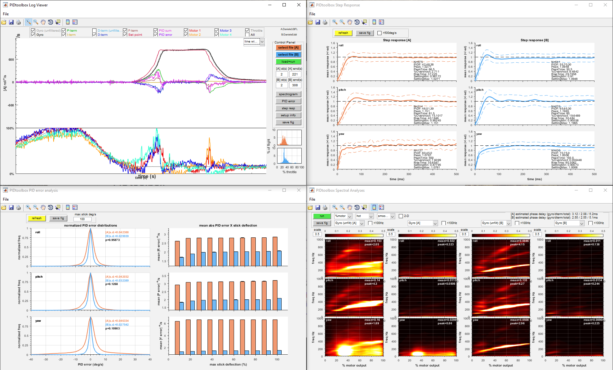

# PIDtoolbox

PIDtoolbox is a set of Matlab-based tools for analyzing Betaflight blackbox log data for multirotors.

The motivation for the development of this tool was to create a user-friendly GUI for analyzing blackbox data, using a high-level language with simple plotting and visualization tools that are more accessible to a larger part of the FPV community. A second goal was to develop an objective method for comparing between flights. It was inspired by the way we often troubleshoot flight performance issues (e.g., vibrations, mid-throttle oscillation, propwash), where we make back to back test flights with slight changes in software/hardware/mechanical settings with each test, and then make subjective inferences about flight performance. The problem is subjective bias becomes a real issue when the differences between tests are subtle. PIDtoolbox was designed with this in mind.

**<a href="https://github.com/bw1129/PIDtoolbox/releases/tag/v0.2" target="blank">PIDtoolbox_v0.2</a>** is aimed at being a "one stop shop" set of tools centered around the main interests/issues of multirotor pilots. Version 0.2 features an extensive data Log Viewer, four independent Spectral Analyzers, Step Response and PID error analyses tools, as well as numerical summaries of results superimposed on the plots for more accurate direct comparisons (for a detailed guide to PIDtoolbox, visit the **<a href="https://github.com/bw1129/PIDtoolbox/wiki/PIDtoolbox-user-guide" target="blank">PIDtoolbox Wiki page</a>.**). Below is everything you need to begin using PIDtoolbox.

# Download

**1)** If you have Matlab, you can simply download the source code (Windows or Mac), place the mfiles in a folder, and run **`PIDtoolbox.m`** from the Matlab command prompt (make sure **`blackbox_decode.exe`** is in the folder with your log files. You will need several toolboxes installed for this to work (control toolbox, signal processing toolbox, image processing toolbox and statistics toolbox). I am also working on converting the code to run in **<a href="https://www.gnu.org/software/octave/" target="blank">Octave</a>**, a free high-level programming platform that was designed to be largely compatible with Matlab (thanks <a href="https://www.facebook.com/UAVTech1/" target="blank">Mark Spatz</a> for bringing this to my attention!).

**2)** If you do not have Matlab, you can download standalone Windows or Mac versions of PIDtoolbox. You must first install Matlab runtime (MATLAB® Compiler Runtime, MCR) using the **`MyAppInstaller_web`** installation file included in the package (under the `runtime_installation_file` folder). **64 bit machines only! This will not work on 32bit.** This is a fairly large download, but the good news is it is a one-time installation, after which you can run any Matlab standalone! If you have already been running a previous version of PIDtoolbox, you do not need to reinstall runtime, but I would recommend deleting/archiving the old version of PIDtoolbox and its contents before running the latest version. 

**(3)** Download **<a href="https://github.com/bw1129/PIDtoolbox/releases/tag/v0.2" target="blank">PIDtoolbox_v0.2</a>** for Windows or Mac **64 bit only!**. Unzip and place entire folder in a preferred location on your computer. **`PIDtoolbox.exe`** can be found under **`PIDtoolbox\main\PIDtoolbox.exe`**. IMPORTANT, the contents of the **`main`** folder must remain there, so I'd recommend creating a shortcut to **`PIDtoolbox.exe`** and placing it on your desktop. Also, PIDtoolbox v0.2 uses **`blackbox_decode.exe`** from <a href="https://github.com/betaflight/blackbox-tools" target="blank">Betaflight/Cleanflight Blackbox Tools</a>, which is conveniently packaged within this download. **`blackbox_decode.exe`** must also remain in the main folder. Please place your **`.bbl`** or **`.bfl`** log files right in that same main folder.

PIDtoolbox has been confirmed to run on Windows7/8/10 64bit machines, and Mac 10.11 (El capitan) and 10.13 (Sierra). If you have issues installing Matlab runtime, or running PIDtoolbox, please give feedback here **<a href="https://github.com/bw1129/PIDtoolbox/issues" target="blank">(issues)</a>**,
or drop a post to the **<a href="https://www.facebook.com/groups/291745494678694/?ref=bookmarks" target="blank">Betaflight BlackBox Log Review Facebook group</a>**.

# How to use

For a detailed guide to PIDtoolbox, please visit the **<a href="https://github.com/bw1129/PIDtoolbox/wiki/PIDtoolbox-user-guide" target="blank">PIDtoolbox Wiki page</a>**.

For a quick guide, follow the steps below:

**(i)** Older versions of PIDtoolbox (pre v0.2) used **`.csv`** files exported from <a href="https://www.github.com/betaflight/blackbox-log-viewer/releases" target="blank">Betaflight Blackbox-log-viewer</a>. **<a href="https://github.com/bw1129/PIDtoolbox/releases/tag/v0.2" target="blank">PIDtoolbox_v0.2</a>** has done away with that step, and now reads **`.bbl`** or **`.bfl`** files directly by using **`blackbox_decode.exe`** <a href="https://github.com/betaflight/blackbox-tools" target="blank">(Betaflight/Cleanflight Blackbox Tools)</a>, which is conveniently packaged within the PIDtoolbox v0.2 download. Just place your **`.bbl`** or **`.bfl`** files right in the main folder where **`PIDtoolbox.exe`** and **`blackbox_decode.exe`** are already located. As stated earlier, the contents of this folder MUST not be moved.

**(ii)** It is recommended to log at 2k (unless you're running 1k loop rate in which case log at 1k), because the spectrograms only go to 1k. It is not recommended to log higher than 4k. It'll run, but much slower.

**(iii)** It is recommended that you set debug mode to **`GYRO_SCALED`** for PIDtoolbox. This is because the program expects the debug variables to contain the unfiltered gyro data, which is used to plot the filtered vs unfiltered gyro spectrograms, and compute gyro phase latency online. If you are using RPM filter in BF4.0, PIDtoolbox v0.2 will recognize if you have debug mode set to **`DSHOT_RPM_TELEMETRY`**, and will plot RPM data along with motor signals in the Log Viewer. Just be aware that the debug mode you choose will result in different data contained in the 'gyro unfiltered' variable. For a list of debug modes and the data contained in the debug variable, see the **<a href="https://github.com/betaflight/betaflight/wiki/Debug-Modes" target="blank">Betaflight debug modes wiki</a>**.

If you have issues installing Matlab runtime, or running PIDtoolbox, please post feedback here
**<a href="https://github.com/bw1129/PIDtoolbox/issues" target="blank">(issues)</a>**,
or drop a post to the **<a href="https://www.facebook.com/groups/291745494678694/?ref=bookmarks" target="blank">Betaflight BlackBox Log Review Facebook group</a>**.

 I hope you find PIDtoolbox useful, and I welcome feedback from the FPV community.

Cheers! -Brian
